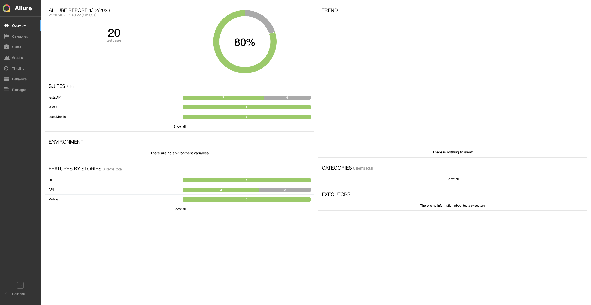
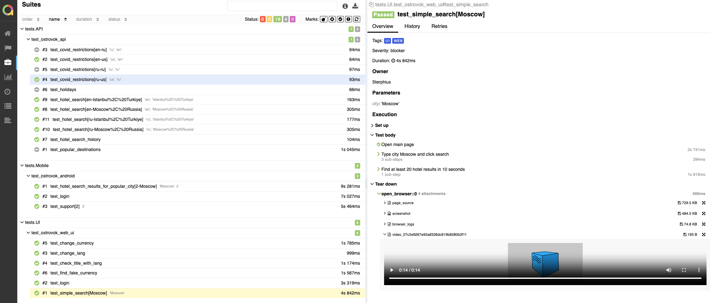

## An example of organizing auto-testing for the Ostrovok.ru booking service
> Ostrovok.ru is a Russian online hotel booking service.


## Impemented tests:
* UI
  * ✅ Search results
  * ✅ User login via e-mail
  * ✅ Page language check
  * ✅ Header localisation
  * ✅ Search and change currency
  * ✅ Search for unlisted currency

* API
  * ✅ Get list of popular destinations
  * ✅ Obtaining restrictions due to COVID-19 \
  With parameters:
    > country_code: ['us', 'ru'] \
    > lang: ['en', 'ru']
  * ✅ Return of holidays list
  * ✅ Search history
  * ✅ Search results query \
    With parameters:
    > query: ['Moscow, Russia', 'Istanbul, Turkiye'] \
    > locale: ['en', 'ru']

* Android
  * ✅ Find hotels for popular city
  * ✅ User login via e-mail
  * ✅ Support phones displays


## Technology stack
Python, Pytest, Selene, PyCharm, Requests, Appium, Jenkins, Selenoid, Github, Telegram

<p  align="center">
  
  
  
  
  
  
  
  
  
</p>

## How to launch
Before execution, you must:
* Define configuration options:
    - login, password for selenoid in .env file
    SELENOID_LOGIN=user
    SELENOID_PASSWORD=password
    - ostrovok.ru user credentials in .env file
    TEST_USER_EMAIL=some_mail@gmail.com
    TEST_USER_PASSWORD=password
    - add browserstack userName and accessKey in config.personal.env
    browserstack.userName='userName'
    browserstack.accessKey='accessKey'

### Local launch
```bash
pip install poetry
poetry install
source .venv/bin/activate
env context=$CONTEXT pytest $TESTS_FOLDER
```

### Run variables
* TESTS_FOLDER - tests folder\
tests/API\
tests/Mobile\
tests/UI\
Default value: . (run all tests)

* CONTEXT - context for launching a mobile application\
local - run via Appium on localhost\
personal - run via BrowserStack\
Default value: personal

### Remote launch
```bash
python -m venv .venv
source .venv/bin/activate
pip install poetry
poetry install
env context=$CONTEXT pytest $TESTS_FOLDER
```

### Tests run video
* UI browser tests


* Mobile


### Launch in Jenkins
Tests run statistics <br >


### Launch variables <br >


### Allure Report
Report available at https://sterphius.github.io/ostrovok_tests/


### Tests run notification message in Telegram

