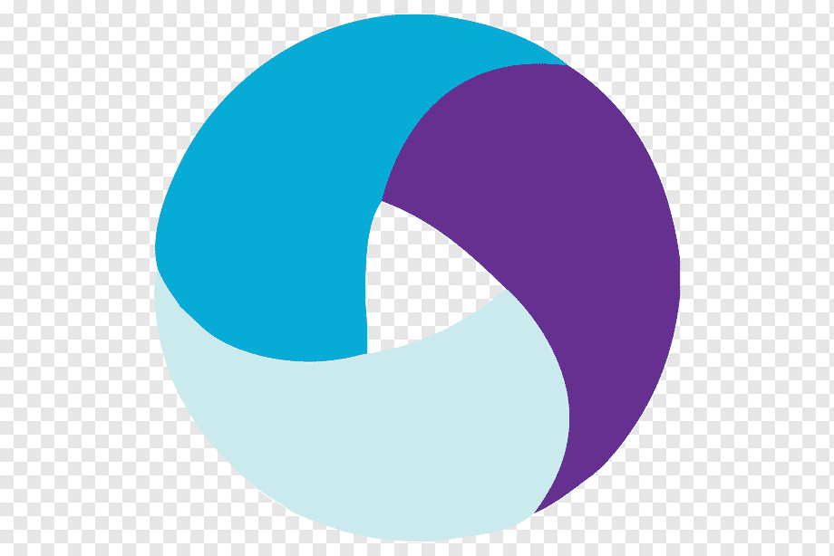
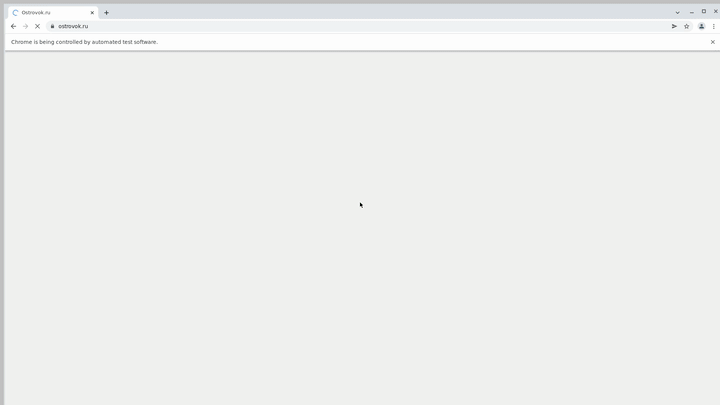
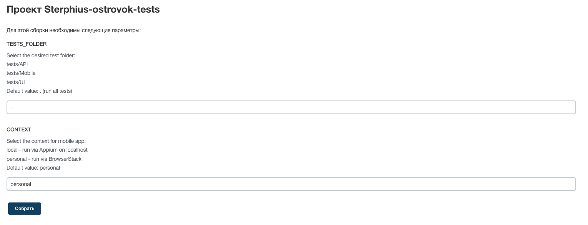
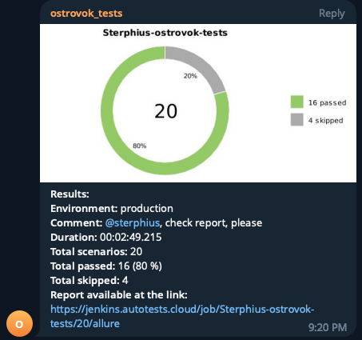

## Пример организации автотестирования для cервиса бронирования Ostrovok.ru
> Ostrovok.ru — российский сервис онлайн-бронирования отелей.


## Покрыт следующий функционал
* UI - тесты
    * ✅ Проверка результатов поиска
    * ✅ Проверка логина с помощью e-mail
    * ✅ Проверка изменения языка
    * ✅ Проверка локализации заголовка
    * ✅ Проверка поиска и изменения валюты
    * ✅ Проверка поиска неизвестной валюты
    

* API тесты
  * ✅ Проверка получения списка популярных направлений
  * ✅ Проверка получения ограничений в связи с COVID-19 \
  С  параметрами:
    > country_code: ['us', 'ru'] \
    > lang: ['en', 'ru']
  * ✅ Проверка списка возвращаемых праздников
  * ✅ Проверка истории поиска
  * ✅ Проверка поиска \
    С  параметрами:
    > query: ['Moscow, Russia', 'Istanbul, Turkiye'] \
    > locale: ['en', 'ru']

* Android тесты
  * ✅ Проверка поиска отелей для популярного города
  * ✅ Проверка логина пользователя
  * ✅ Проверка отображения телефонов поддержки


## Технологический стек
Python, Pytest, Selene, PyCharm, Requests, Appium, Jenkins, Selenoid, Github, Telegram

<p  align="left">
<code>
  
  
  
  
  
  
  
  
  
</code>
</p>

## Как запустить
Перед выполением необходимо:
* В .env определить параметры конфигурации:
    - login, password for selenoid в .env  
    SELENOID_LOGIN=user  
    SELENOID_PASSWORD=password
    - credentials пользователя ostrovok.ru в .env  
    TEST_USER_EMAIL=some_mail@gmail.com  
    TEST_USER_PASSWORD=password
    - в config.personal.env добавить browserstack userName и accessKey
    browserstack.userName='userName'
    browserstack.accessKey='accessKey'

### Локально
```bash
pip install poetry
poetry install
source .venv/bin/activate
env context=$CONTEXT pytest $TESTS_FOLDER
```

### Переменные для запуска
* TESTS_FOLDER - папка с тестами\
tests/API\
tests/Mobile\
tests/UI\
Default value: . (run all tests)

* CONTEXT - контекст для запуска мобильного приложения\
local - run via Appium on localhost\
personal - run via BrowserStack\
Default value: personal

### Удаленно
```bash
python -m venv .venv
source .venv/bin/activate
pip install poetry
poetry install
env context=$CONTEXT pytest $TESTS_FOLDER
```

### Видео о прохождении тестов
* UI browser tests  

* Mobile  


### Запуск в Jenkins
Статистика по запускам <br >


### Параметры запуска <br >


### Отчёт о прохождении автотестов в Allure Report


### Список автотестов в Allure Report


### Уведомления о прохождении автотестов в Telegram
