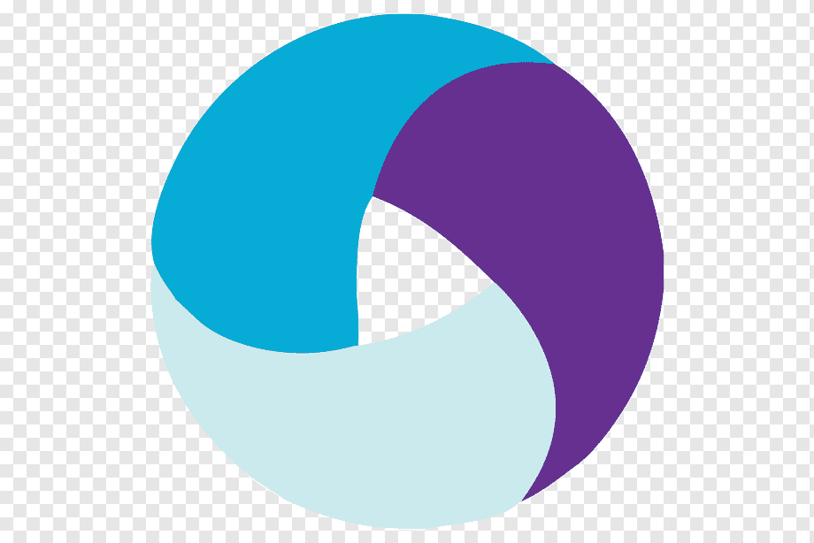
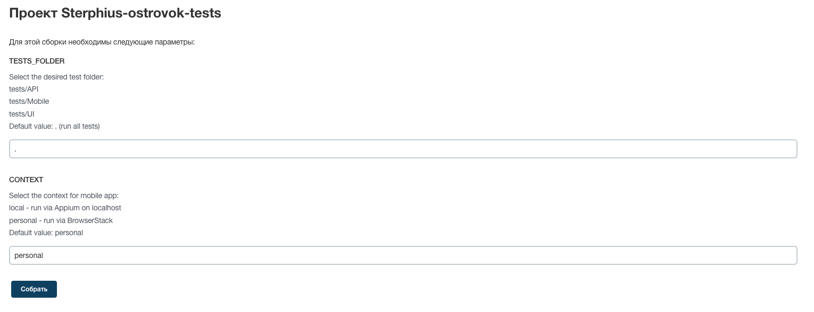

## Пример организации автотестирования для cервиса бронирования Ostrovok.ru
> Ostrovok.ru — российский сервис онлайн-бронирования отелей.


## Реализованы тесты:
* UI
  * ✅ Результатов поиска
  * ✅ Логина с помощью e-mail
  * ✅ Изменения языка
  * ✅ Локализации заголовка
  * ✅ Поиска и изменения валюты
  * ✅ Поиска неизвестной валюты
    
* API
  * ✅ Получения списка популярных направлений
  * ✅ Получения ограничений в связи с COVID-19 \
  С  параметрами:
    > country_code: ['us', 'ru'] \
    > lang: ['en', 'ru']
  * ✅ Списка возвращаемых праздников
  * ✅ Истории поиска
  * ✅ Проверка результатов поиска \
    С  параметрами:
    > query: ['Moscow, Russia', 'Istanbul, Turkiye'] \
    > locale: ['en', 'ru']

* Android
  * ✅ Результат поиска отелей для популярного города
  * ✅ Логина пользователя с помощью e-mail
  * ✅ Отображения телефонов поддержки


## Технологический стек
Python, Pytest, Selene, PyCharm, Requests, Appium, Jenkins, Selenoid, Github, Telegram

<p  align="center">
  
  
  
  
  
  
  
  
  
</p>

## Как запустить
Перед выполением необходимо:
* В .env определить параметры конфигурации:
    - login, password for selenoid в .env  
    SELENOID_LOGIN=user  
    SELENOID_PASSWORD=password
    - credentials пользователя ostrovok.ru в .env  
    TEST_USER_EMAIL=some_mail@gmail.com  
    TEST_USER_PASSWORD=password
    - в config.personal.env добавить browserstack userName и accessKey
    browserstack.userName='userName'
    browserstack.accessKey='accessKey'

### Локально
```bash
pip install poetry
poetry install
source .venv/bin/activate
env context=$CONTEXT pytest $TESTS_FOLDER
```

### Переменные для запуска
* TESTS_FOLDER - папка с тестами\
tests/API\
tests/Mobile\
tests/UI\
Default value: . (run all tests)

* CONTEXT - контекст для запуска мобильного приложения\
local - run via Appium on localhost\
personal - run via BrowserStack\
Default value: personal

### Удаленно
```bash
python -m venv .venv
source .venv/bin/activate
pip install poetry
poetry install
env context=$CONTEXT pytest $TESTS_FOLDER
```

### Видео о прохождении тестов
* UI browser tests  


* Mobile  


### Запуск в Jenkins
Статистика по запускам <br >


### Параметры запуска <br >


### Отчёт о прохождении автотестов в Allure Report


### Уведомления о прохождении автотестов в Telegram
